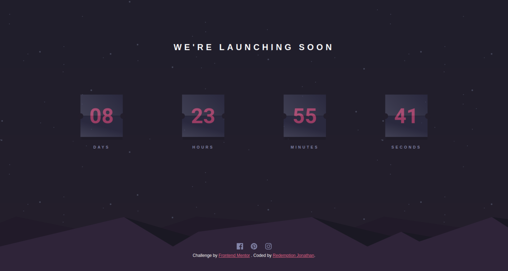

# Frontend Mentor - Launch countdown timer

## Welcome! 👋

Thanks for checking out this front-end coding challenge.

[Frontend Mentor](https://www.frontendmentor.io) challenges allow you to improve your skills in a real-life workflow.

**To do this challenge, you need a good understanding of HTML, CSS and JavaScript.**

## The challenge

This is a launch count written in HTML5, CSS3 and vanilla Javascript.

What is required to be done are:

- Hover states for all interactive elements on the page
- A live countdown timer that ticks down every second (start the count at 14 days)
- **Bonus**: When a number changes, make the card flip from the middle

Want to tryout other challenges to test your skill? [Join our Frontend Mentor today](https://www.frontendmentor.io/)

## Feedback

Feedback is always welcome, so if you have any to give on this challenge please email hi[at]frontendmentor[dot]io.

This challenge is completely free. Please share it with anyone who will find it useful for practice.

**Have fun building!** 🚀
